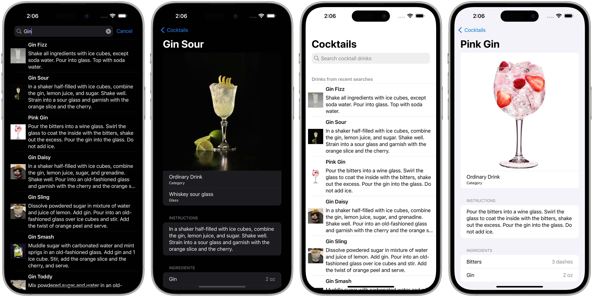

# Cocktails

This repo contains the full source code for *Cocktails*, an iOS app to search cocktail recipes.
 
This application uses [The Cocktail DB's public API](https://www.thecocktaildb.com). To get a JSON response, the URL looks like
https://www.thecocktaildb.com/api/json/v1/1/search.php?s=[searchRequest]
The application has 2 pages. Firstly, a start page to search against the API and displays the results as a list. Once the results
are returned and displayed, the user can click on one of the rows to go to a detail page with the details of the recipe.
 
The app also works offline using data cached from previous searches.

  
Some things you might find interesting:

### The Composable Architecture

The whole application is powered by the [Composable Architecture](https://github.com/pointfreeco/swift-composable-architecture), a library built from scratch by [Brandon Williams](https://twitter.com/mbrandonw) and [Stephen Celis](https://twitter.com/stephencelis) on [Point-Free](https://www.pointfree.co/collections/composable-architecture) that provides tools for building applications with a focus on composability, modularity, and testability. This means:

* The entire app's state is held in a single source of truth, called a `Store`.
* The entire app's behavior is implemented by a single unit, called a `Reducer`, which is composed out of many other reducers.
* All effectful operations are made explicit as values returned from reducers.
* Dependencies are made explicit as simple data types wrapping their live implementations, along with various mock instances.

There are a ton of benefits to designing applications in this manner:

* Large, complex features can be broken down into smaller child domains, and those domains can communicate via simple state mutations. Typically this is done in SwiftUI by accessing singletons inside `ObservableObject` instances, but this is not necessary in the Composable Architecture.
* We take control of dependencies rather than allow them to take control of us. Just because you are using `StoreKit`, `GameCenter`, `UserNotifications`, or any other 3rd party APIs in your code, it doesn't mean you should sacrifice your ability to run your app in the simulator, SwiftUI previews, or write concise tests.
* Exhaustive tests can be written very quickly. We test very detailed user flows, capture subtle edge cases, and assert on how effects execute and how their outputs feed back into the application.
* It is straightforward to write integration tests that exercise multiple independent parts of the application.
